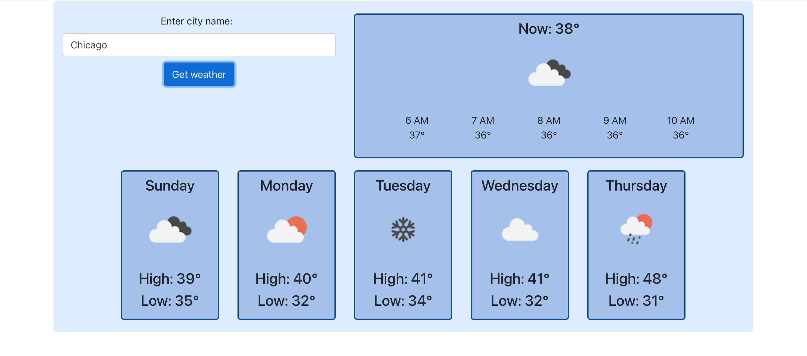

Preview of weather app, if you don't want to go to the trouble of creating an API key:

## Create API Key

Tester should create an account and API key at: https://openweathermap.org/api (it takes a few hours to become active), fill it into `.env.example`, and rename the file: `.env`.

## Available Scripts

In the project directory, you can run:

### `yarn start`

Runs the weather app in development mode.
Open [http://localhost:3000](http://localhost:3000) to view it in the browser.

### `yarn test`

Runs tests against the weather API

--

This project was bootstrapped with [Create React App](https://github.com/facebook/create-react-app).

